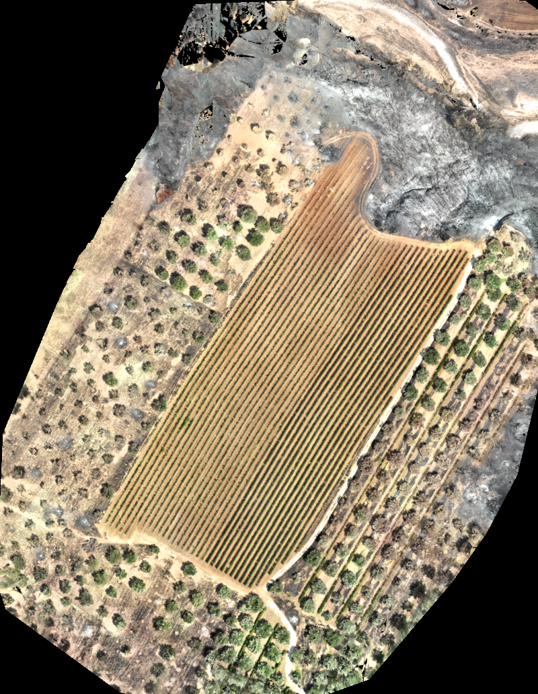
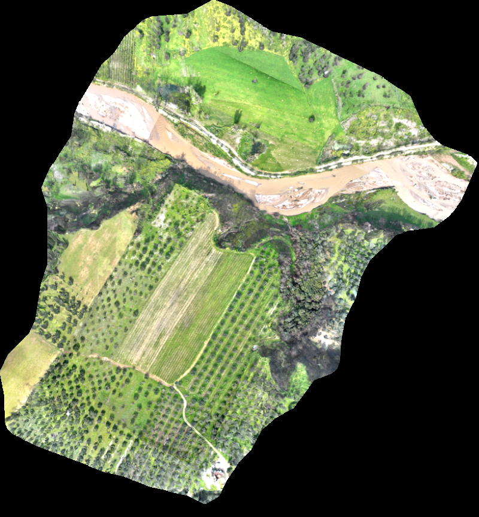
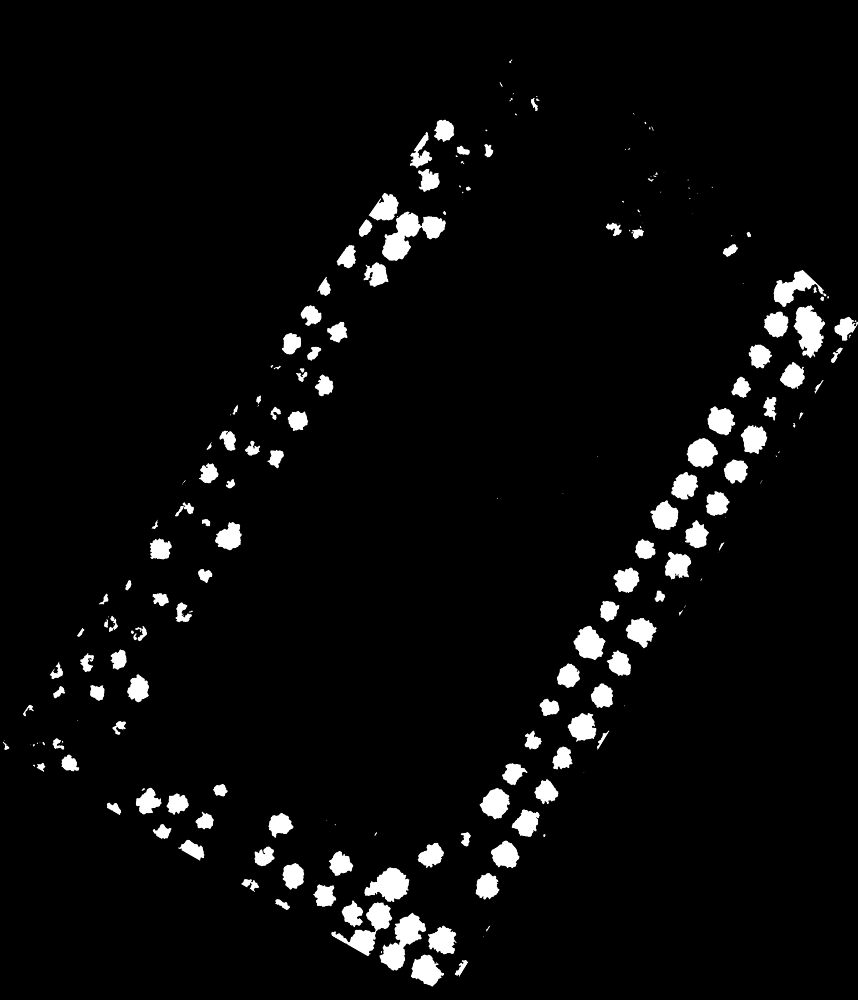
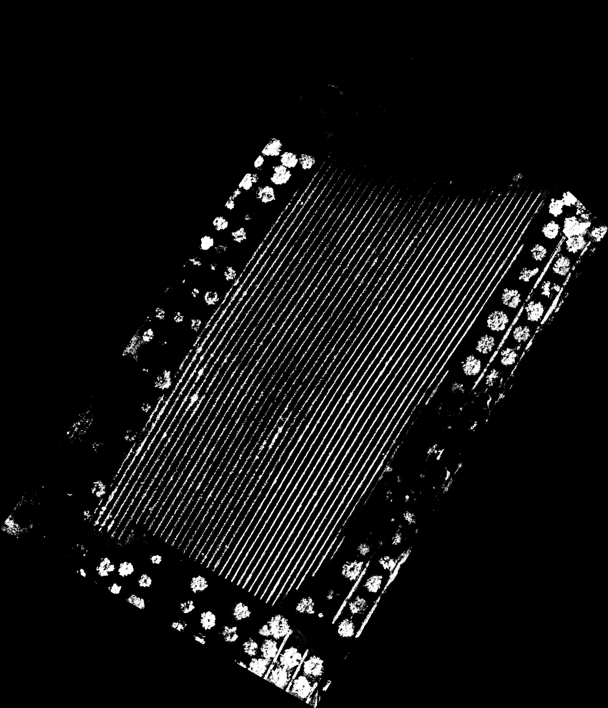
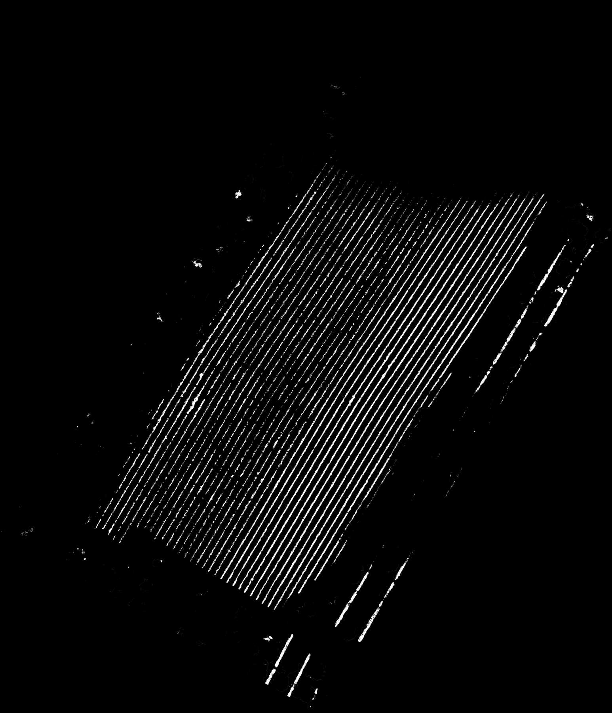
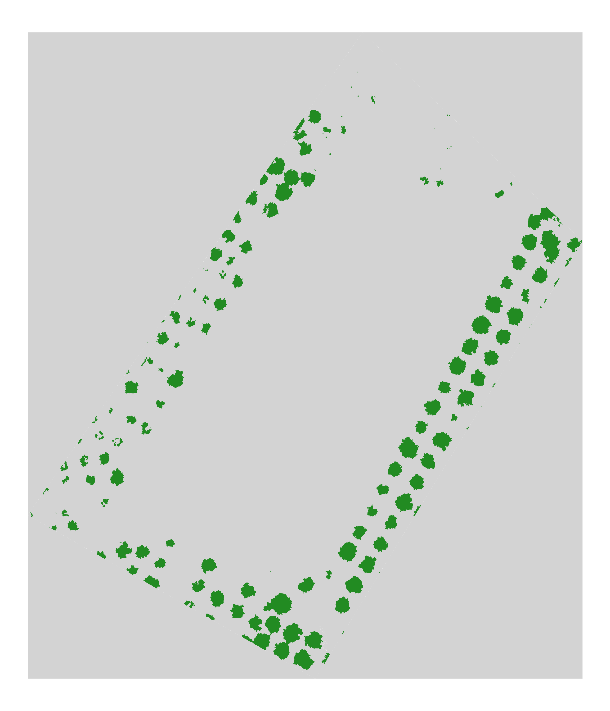
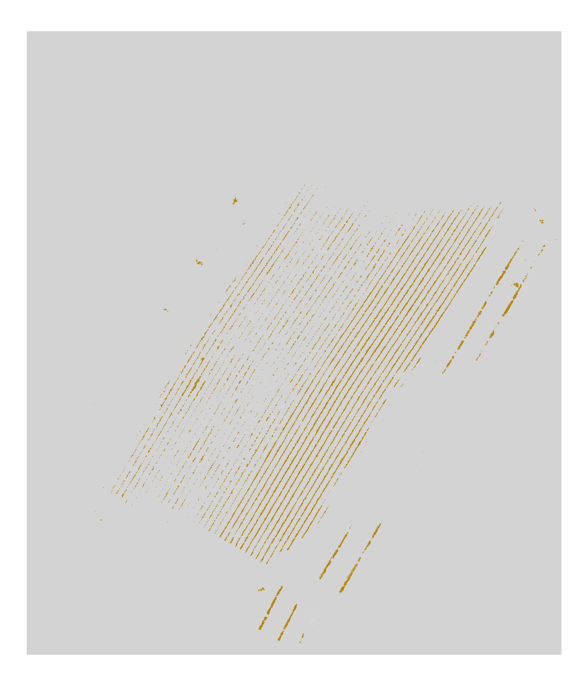
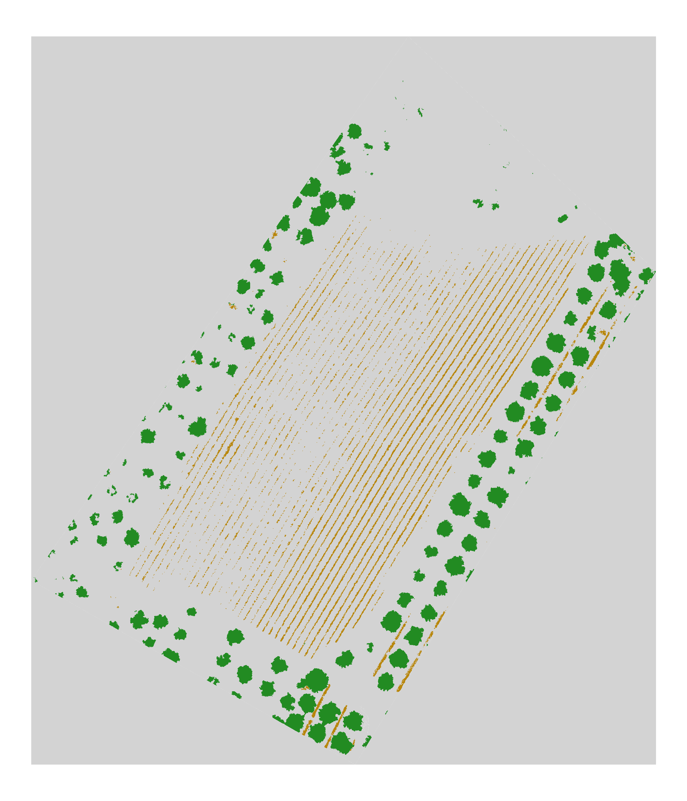
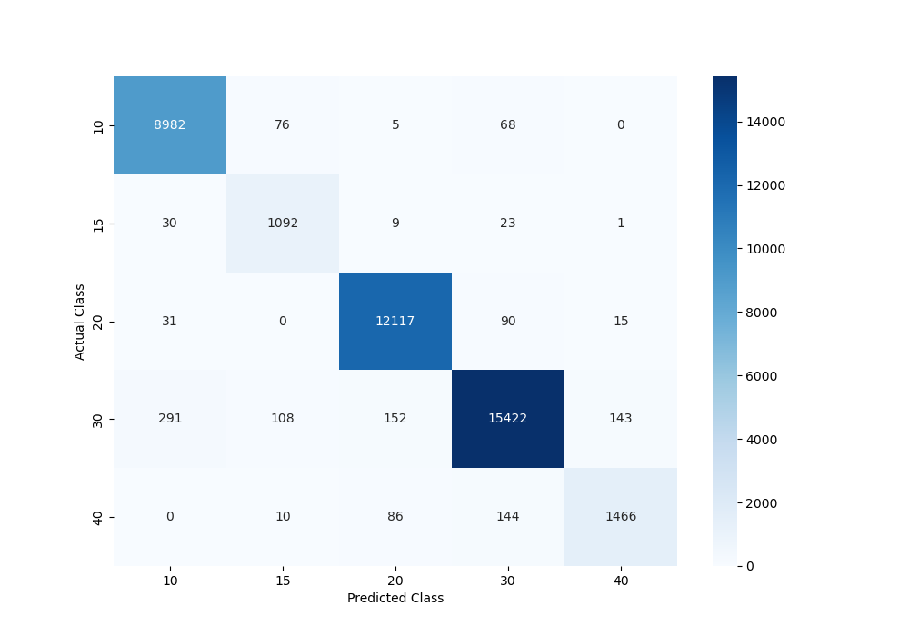

# UAV Wildfire Recovery Monitoring

> **A deep-learning time-series analysis of vegetation recovery following a wildfire in Patras, Greece.**

## 📖 Project Overview
This research investigates how different landcover classes (vines, olive trees, soil, and burned areas) develop and recover over time after a wildfire event. Using high-resolution UAV (Unmanned Aerial Vehicle) imagery, we analyze temporal changes through RGB-based vegetation indices (ExG, VARI, NGRDI) and structural data (Canopy Height Models). 

By leveraging Convolutional Neural Networks (CNNs) for precise landcover classification and monitoring these zones across multiple flight dates, this project aims to provide quantitative insights into post-fire ecosystem recovery.

## 🗂️ Dataset Description
The study area is located in a mixed agricultural zone (vineyards and olive groves) in **Patras, Greece**. The first flight was conducted shortly after the wildfire, capturing the immediate damage, followed by several monitoring flights in the following months.

* **Sensor:** DJI Mavic 3E - RGB Camera
* **Spatial Resolution:** ~2.5 cm/pixel (Standardized)
* **Provided Data:** RGB Imagery + standalone Digital Surface Model (DSM)
* **Flight Dates:**
  * `21.08.2025` (Immediate post-fire)
  * `01.09.2025`
  * `26.10.2025`
  * `04.02.2026`
  * `22.02.2026`
  * *(Ongoing monitoring...)*

*Visual examples of the study area over time:*

  
   
  <b>Fig 1:</b> Immediate Post-Fire (21.08.2025) &nbsp;&nbsp;&nbsp;&nbsp;&nbsp;&nbsp;&nbsp;&nbsp;&nbsp;&nbsp;&nbsp;&nbsp; <b>Fig 2:</b> 6 Months Recovery (22.02.2026)

## ⚙️ Methodology & Pipeline

The pipeline is structured into several sequential processing steps to ensure spatial accuracy and meaningful feature extraction before applying CNN for Landcover Classification. 

### Step 1: Data Preparation, Coregistration & Resampling
To perform accurate time-series analysis, all pixels across all dates must align perfectly. If a pixel represents a specific area in August 2025, the exact same pixel must represent the exact same area in February 2026.

1. **Data Stacking:** The separate DSM is stacked with the RGB imagery to form a 4-channel (R-G-B-DSM) composite for each flight date.
2. **Master Reference Selection:** The image from **October 26, 2025**, serves as the master reference. This mid-sequence date was selected to minimize the relative temporal and structural shift between all images and to assure similarity to each image.
3. **Coregistration ([AROSICS](https://github.com/GFZ/arosics)):** To guarantee high-precision spatial alignment, we employ the AROSICS (Automated and Robust Open-Source Image Co-Registration Software) algorithm in a two-step approach:
   * **Global Coregistration:** First, a global spatial X/Y shift is calculated and applied to correct for the absolute geolocation error between the target images and the master reference.
   * **Local Coregistration:** Subsequently, the globally corrected images are coregistered using the local coregistration algorithm. This accounts for fine-scale, localized geometric distortions and sub-pixel misregistrations.
4. **Resampling:** Finally, all images are reprojected and resampled to a strict unified spatial resolution of **2.5 cm/pixel** using `rasterio` (applying `cubic` interpolation). This finalizes the coregistration process, guaranteeing that every image grid is perfectly congruent and ensuring true pixel-to-pixel correspondence across the entire temporal sequence.

### Step 2: Canopy Height Model (CHM) Derivation
The original DSM captures the absolute elevation (including the terrain). To isolate the height of the vegetation (vines and olive trees), we mathematically simulate a Digital Terrain Model (DTM) and subtract it from the DSM.

* **Method:** Sliding-window morphological filtering (~8m window size to bridge tree crowns).
* **Process:**
  1. *Erosion (Minimum Filter):* Removes the above-ground vegetation to find the bare earth.
  2. *Dilation (Maximum Filter):* Corrects artificial terracing on sloped terrain.
  3. *Gaussian Blur:* Smooths the generated DTM for natural transitions.
* **Equation:** `CHM = DSM - DTM`
* **Post-Processing:** Negative height artifacts are clipped to 0,0 and image boundaries are safely padded with `-9999.0` NoData values to prevent morphological border artifacts.

### Step 3: AOI Cropping & Feature Engineering
Before proceeding to classification, the data boundaries needed to be strictly synchronized, and additional spectral features were added to provide the neural network with more predictive power.

1. **Area of Interest (AOI) Cropping:** The spatial extent varies between flight campaigns. To ensure a robust multi-temporal comparison, all datasets were clipped to a common Area of Interest (AOI). This AOI was defined by the first dataset (August 2025), which possessed the smallest spatial footprint (~6.94 ha / 17.16 acres) compared to later flights (e.g., ~39.3 ha in Feb 2026). Furthermore, this clipping safely removes edge artifacts and areas with missing Canopy Height Model (CHM) data that occur along the flight boundaries.
2. **RGB Vegetation Indices:**
   To emphasize vegetative health and recovery over time, three specific RGB-based vegetation indices were derived for all datasets (inspired by [Rodrigo-Comino et al., 2026](https://doi.org/10.1007/s11119-026-10363-4)):
   * **ExG** (Excess Green)
   * **VARI** (Visible Atmospherically Resistant Index)
   * **NGRDI** (Normalized Green Red Difference Index)
3. **Standardization & Final Composite:**
   All bands were linearly standardized to a strict `[0, 1]` range for later CNN application. This results in a final, uniform **7-channel composite** `(R, G, B, CHM, ExG, VARI, NGRDI)` for every single flight date.

### Step 4: Object-Based Segmentation & Automated + Manual Labeling
Since the study's core objective is to track the multi-temporal recovery of static landcover units (e.g., a burned vineyard, olive trees, etc.), the spatial baseline classification only needed to be established once, using the initial (August 2025) image. 

#### 1. Object-Based Image Analysis (OBIA)
Following the methodology outlined by [Ivošević et al., 2025](https://doi.org/10.1038/s41597-025-04437-7), we opted for Object-Based Image Analysis rather than pixel-based classification.
* **Algorithm:** Large-Scale Mean Shift (LSMS), executed via the Orfeo ToolBox (OTB), adapted from [Pajevic's implementation](https://github.com/pajevicnina/inspire1-seg).
* **Rationale:** LSMS clusters pixels into homogeneous, meaningful physical objects (polygons) based on spatial and radiometric proximity. This generates smoother boundaries and allows the classification model to utilize regional statistics (e.g., texture, mean, variance) rather than noisy, isolated pixel values.
* **Parameters:** A strict `range radius` of 3 was uniformly applied to fine-tune the sensitivity toward the high spatial dynamics of the 2.5 cm resolution imagery.

#### 2. Automated Heuristic Pre-Labeling (Pixel-Level)
To generate a baseline of training data without exhaustive manual labeling, we developed a two-step automated labeling heuristic utilizing the `OTSU threshold` implementation of `scikit-image` :

* **Tree Identification:** An Otsu threshold (CHM > `0.4199`) was calculated for the Canopy Height Model (CHM). Pixels exceeding this threshold reliably separated tall structures (Olive Trees, both healthy and burned) from ground features and lower-lying vegetation. 
* **Healthy Vine Identification:** A secondary Otsu threshold was applied specifically to the ExG channel (ExG > `0.4433`). This isolates all healthy, photosynthetically active vegetation. By subsequently subtracting the previously identified Tree pixels from this vegetation mask, the remaining pixels robustly identify Healthy Vines.

*Visualizing the pixel-level heuristic labels:*

  
  
   
  <b>Fig 1:</b> Trees (CHM Otsu) &nbsp;&nbsp;&nbsp;&nbsp;&nbsp;&nbsp;&nbsp; <b>Fig 2:</b> Healthy Veg (ExG Otsu) &nbsp;&nbsp;&nbsp;&nbsp;&nbsp;&nbsp;&nbsp; <b>Fig 3:</b> Isolated Vines

#### 3. Label Transfer to Polygons
The pixel-level heuristic masks were then spatially joined with the LSMS polygons generated in Step 3.1. A strict majority-rule was enforced: **If a polygon contained more than 80% pixels of a specific class (Tree or Vine), the entire polygon inherited that class label.**
This automated process rapidly yielded a strong foundational dataset of:
* **Tree Polygons:** `44,195` 
* **Vine Polygons:** `25,557`

*Visualizing the final automated object labels:*

  
  
   
  <b>Fig A:</b> Trees (Class 20) &nbsp;&nbsp;&nbsp;&nbsp;&nbsp;&nbsp;&nbsp;&nbsp;&nbsp;&nbsp; <b>Fig B:</b> Vines (Class 10) &nbsp;&nbsp;&nbsp;&nbsp;&nbsp;&nbsp;&nbsp;&nbsp;&nbsp;&nbsp; <b>Fig C:</b> Combined

#### 4. Manual Enrichment & Final Training Dataset
While the automated heuristic successfully mapped vital vegetation and trees, the remaining post-fire landscape features required manual classification. Using QGIS, the automated dataset was extensively enriched by manually labeling and correcting polygons across five distinct target classes:
* `10`: Vineyard (Vital)
* `15`: Vineyard (Burned)
* `20`: Olive Tree (Vital & Burned)
* `30`: Bare Soil
* `40`: Burned Area

Merging the automated heuristic labels with the manual QGIS annotations resulted in the final, comprehensive training dataset. The data exhibits a natural, real-world class imbalance, totaling over 160,000 labeled samples:

| Class ID | Landcover Class | Polygon Count | Share (%) |
| :--- | :--- | :--- | :--- |
| **-1** | Unlabeled (Target) | 372,085 | 69.2% |
| **30** | Bare Soil | 64,421 | 12.0% |
| **20** | Olive Tree | 45,837 | 8.5% |
| **10** | Vineyard (Vital) | 26,969 | 5.0% |
| **40** | Burned Area | 23,956 | 4.5% |
| **15** | Vineyard (Burned) | 3,247 | 0.8% |
| **Total** | | **536,515** | **100%** |

*(Polygons marked as `-1` serve as the target area for CNN prediction, while the remaining ~164k samples represent the robust training foundation).*
   
### Step 5: Deep Learning Landcover Classification (CNN)
With the labeled polygons and the 7-channel August 2025 image ready, a Convolutional Neural Network (CNN) was trained to classify the landscape. The architecture and training pipeline were adapted from [Rana Vaqcar's CNN implementation](https://github.com/ranavaqcar1989/CNN-Training-pipeline) and customized for this specific application.

#### 1. Spatial Leakage-Free Data Splitting
Before training, the 160,000+ labeled polygons from the August 2025 dataset were split into a **Training Set (80%)** and a **Validation/Test Set (20%)**.
A common pitfall in remote sensing is spatial data leakage, where adjacent polygons (often sharing overlapping pixel patches) are randomly divided into training and testing sets, falsely inflating model accuracy. To prevent this, the labeled polygons were split using a strict **Spatial Block-Split methodology**.
* **Grid Clustering:** The entire Area of Interest was discretely divided into a 50x50 meter spatial grid, resulting in 23 distinct geographic clusters.
* **Group Split:** The split was performed at the cluster level rather than the polygon level. All polygons falling within a specific 50x50m block were assigned entirely to either the Training Set or the Validation Set. 
* **Result:** This ensures that the CNN is evaluated on completely unseen geographic regions. Despite the rigidity of block-splitting, the algorithm successfully preserved a healthy representation of all minority classes (e.g., Burned Vineyards) in both sets.

#### 2. Patch Extraction & CNN Architecture
For every polygon, a `128 x 128` pixel patch was extracted around its geometric centroid, capturing the 7 spectral and structural channels (R, G, B, CHM, ExG, VARI, NGRDI).

The CNN follows a robust, 4-block architecture designed for spatial feature extraction:
* **Feature Extraction:** Four sequential blocks consisting of 2D Convolutions (`Conv2D` with increasing filters: 32 → 64 → 128 → 256), `BatchNormalization` (to stabilize learning), and `MaxPooling2D` (to reduce spatial dimensions).
* **Classification Head:** A `GlobalAveragePooling2D` layer flattens the feature maps, followed by a fully connected `Dense` layer (256 units), `Dropout` (0.5 to prevent overfitting), and a final `Softmax` output layer mapping to the 5 target classes.

#### 3. Training Dynamics
To ensure the model learns effectively despite the heavily imbalanced dataset, several advanced training strategies were employed:
* **Class Weighting:** The loss function was penalized using balanced class weights, forcing the network to pay significantly more attention to minority classes (e.g., Burned Vines) compared to majority classes (e.g., Bare Soil).
* **On-the-Fly Data Augmentation:** Training patches were dynamically rotated and flipped. This artificially expands the dataset and makes the model invariant to the orientation of trees or vine rows.
* **Optimization:** Trained over a maximum of 200 epochs using the Adam optimizer (`lr=0.0005`), supported by `ReduceLROnPlateau` (to fine-tune learning as it converges) and `EarlyStopping` (to halt training and restore the best weights if validation loss stops improving).

---

## 📊 Classification Results & Model Evaluation
The trained CNN was evaluated strictly on the unseen 20% validation polygons to assess its real-world generalization capabilities. 

* **Metrics:** The model's performance is quantified using Overall Accuracy, the Cohen’s Kappa Index (which accounts for chance agreement in imbalanced datasets), and detailed precision/recall/F1-scores for each specific class.
* **Confusion Matrix:** The matrix below illustrates the model's predictive performance, highlighting its ability to distinguish between vital vegetation, burned areas, and bare soil.

  

*(Note: Exact quantitative results, including Accuracy and Kappa Index, can be found in the `cnn_evaluation_results.txt` file generated during the evaluation phase).*
---
*Repository structure, code, and further documentation will be added as the research progresses.*